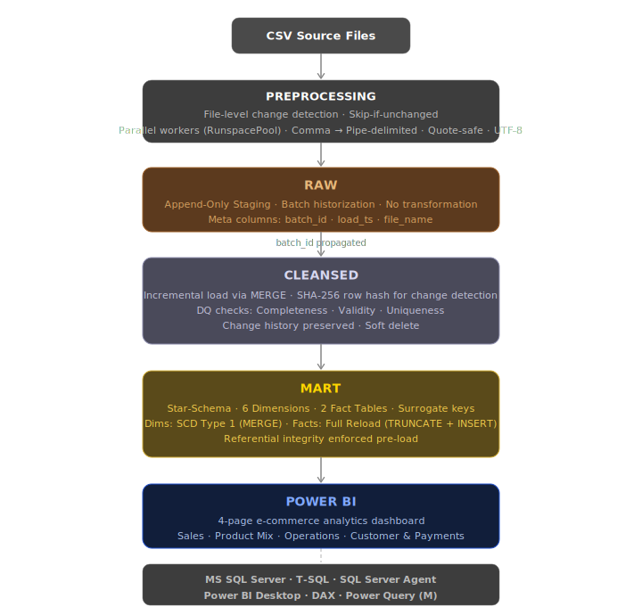
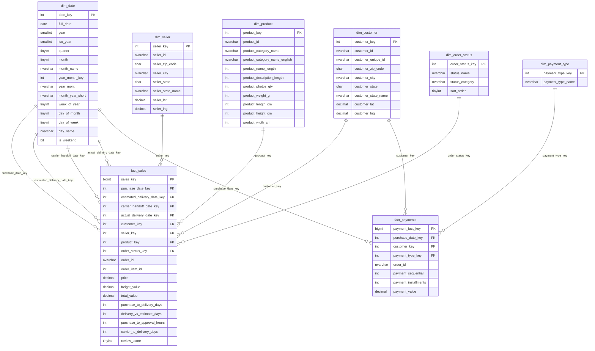
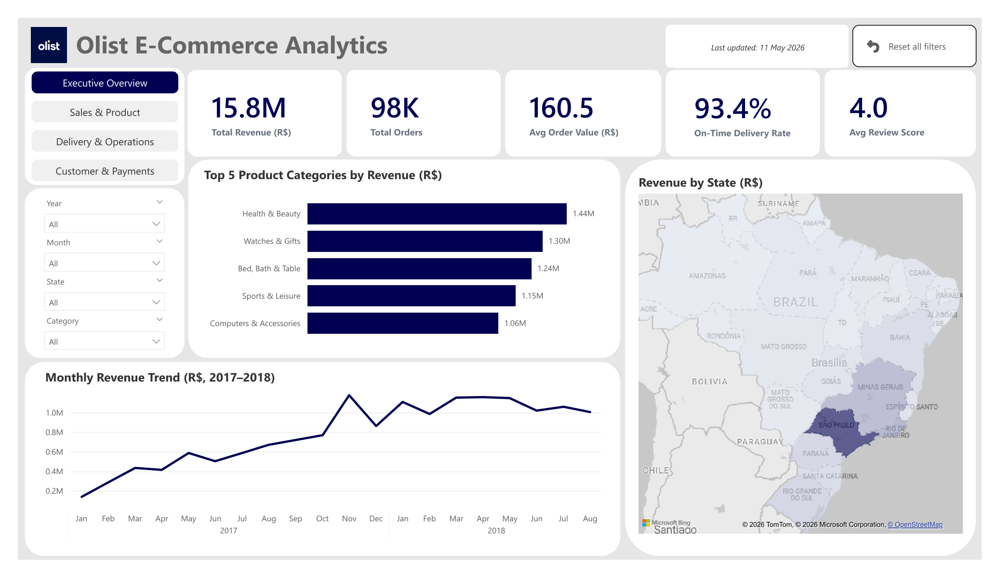

# Olist E-Commerce Data Warehouse (SQL Server)

End-to-End Data Warehouse auf Basis des öffentlichen [Olist Brazilian E-Commerce Datensatzes](https://www.kaggle.com/datasets/olistbr/brazilian-ecommerce) — rund 100.000 Transaktionen aus dem brasilianischen E-Commerce-Markt.

Ziel des Projekts ist der Aufbau eines produktionsnahen Data Warehouse in SQL Server mit Batch-Historisierung, inkrementellem Ladekonzept und vollständigem Audit-Trail. Implementiert werden gängige Patterns aus der Praxis: Metadata-Driven Orchestrierung über eine zentrale Konfigurationstabelle, Datenqualitätsprüfung, Soft Delete und transaktionssichere Stored Procedures.

---

## Architektur



### Querschnittsschemas

| Schema          | Inhalt                                                                                                                   |
| --------------- | ------------------------------------------------------------------------------------------------------------------------ |
| `audit`         | `load_log`, `error_log`, `dq_log`, `job_log` — vollständiger Audit-Trail jedes Ladevorgangs                              |
| `orchestration` | `pipeline_config` (Metadata Framework), `sp_run_layer`, `sp_run_full_load`, `agent_job_full_load` (SQL Server Agent Job) |

### Mart — Star-Schema (ERD)



---

## Dashboard

### Page 1 — Executive Overview



DAX Measures: [`powerbi/te_create_measures.csx`](powerbi/te_create_measures.csx)

---

## Pipeline-Design

### Preprocessing — CSV-Konvertierung

Einige Quelldateien enthalten in Feldern eingebettete Kommas oder Zeilenumbrüche (z.B. Geodaten, Bewertungstexte), die `BULK INSERT` auf SQL Server on-premises nicht korrekt verarbeiten kann (`IID_IColumnsInfo` OLE DB-Einschränkung). Für diese Dateien führt `preprocess_all.ps1` vor dem RAW-Load eine Konvertierung durch: comma-delimited mit gequoteten Feldern -> pipe-delimited ohne Quoting.

Welche Pipelines vorverarbeitet werden, steuert die Spalte `needs_preprocessing = 1` in `orchestration.pipeline_config`. Das Preprocessing wird nur ausgeführt, wenn die Quelldatei seit dem letzten erfolgreichen RAW-Load geändert wurde (`LastWriteTimeUtc > last_success_ts` aus `audit.load_log`). Unveränderte Dateien werden übersprungen. Die Ausgabedateien werden bei jedem Lauf überschrieben — es findet keine Akkumulation statt.

### Raw — Append-Only Staging mit Batch-Historisierung

Jeder Load erhält eine eindeutige `batch_id` (GUID), die allen Zeilen des Batches zugewiesen wird. Die raw-Tabellen wachsen mit jedem Load — Historisierung auf Batch-Ebene ist damit vollständig gewährleistet. Non-Clustered Indexes auf `batch_id` stellen sicher, dass der `WHERE batch_id = @batch_id`-Filter in den CLEANSED-SPs als Index Seek ausgeführt wird.

### Cleansed — Inkrementelles Ladekonzept mit DQ-Checks

Der CLEANSED-Layer liest aus RAW über die `batch_id` des letzten erfolgreichen RAW-Loads. Das MERGE-Statement erkennt Änderungen über einen SHA2-256-Hash aller fachlichen Spalten:

```sql
HASHBYTES('SHA2_256', CONCAT(col1, '|', col2, '|', ...)) AS row_hash
```

Zeilen, die im aktuellen Batch nicht mehr vorkommen, werden **soft-deleted** (`is_deleted = 1`, `deleted_at`) statt physisch gelöscht — der Audit-Trail und Mart-FK-Referenzen bleiben intakt. Wiederauftauchende Datensätze werden automatisch reaktiviert.

### Mart — Star-Schema mit Full-Reload und SCD Type 1

Der MART-Layer implementiert ein Kimball-Stern-Schema mit 6 Dimensionen und 2 Faktentabellen.

**Dimensionen** werden über SCD Type 1 MERGE geladen — Änderungen überschreiben den bestehenden Wert, keine Historisierung:

| Dimension             | Typ                  | Besonderheit                                             |
| --------------------- | -------------------- | -------------------------------------------------------- |
| `dim_customer`        | MERGE (SCD Type 1)   | Natural Key: `customer_id`                              |
| `dim_seller`          | MERGE (SCD Type 1)   | Natural Key: `seller_id`                                |
| `dim_product`         | MERGE (SCD Type 1)   | Natural Key: `product_id`                               |
| `dim_date`            | INSERT (WHERE NOT EXISTS) | Tally-CTE, einmalig für 2016–2025 befüllt          |
| `dim_payment_type`    | INSERT (WHERE NOT EXISTS) | Fixer Wertevorrat (5 Typen), idempotent geseedet   |
| `dim_order_status`    | INSERT (WHERE NOT EXISTS) | Fixer Wertevorrat (8 Status), idempotent geseedet  |

**Faktentabellen** werden bei jedem Lauf vollständig neu geladen (TRUNCATE + INSERT) — die Quelldaten sind unveränderlich (abgeschlossene Orders), ein inkrementelles Ladekonzept wäre Overhead ohne Mehrwert.

Für nicht auflösbare FK-Referenzen greifen Sentinel-Werte: `-1` (Unknown Member) für Dimensionsschlüssel, `0` für Datumsschlüssel. Non-Clustered Columnstore Indexes auf beiden Faktentabellen optimieren analytische Abfragen.

Die Mart-SPs erhalten keine `batch_id` — die Rückverfolgbarkeit über Layer-Grenzen erfolgt ausschließlich über `job_run_id`.

### Datenqualitätsprüfung

Vor jedem MERGE im Cleansed-Layer läuft eine CTE-basierte DQ-Prüfung über drei Dimensionen:

| Dimension        | Prüfungen                                                                                                                                        |
| ---------------- | ------------------------------------------------------------------------------------------------------------------------------------------------ |
| **Completeness** | NULL-Werte, leere Strings nach Bereinigung                                                                                                       |
| **Validity**     | Länge, Format (Hex-IDs, numerische Felder, Datumsformat), Wertemenge (z.B. `payment_type`), logische Konsistenz (z.B. Lieferdatum vor Kaufdatum) |
| **Uniqueness**   | Duplikate des Primärschlüssels innerhalb eines Batches                                                                                           |

Ergebnisse werden aggregiert in `audit.dq_log` geschrieben — eine Zeile pro `(column_name, issue)`-Kategorie mit `affected_row_count`. Bei strukturellen Duplikaten (eindeutiger PK verletzt) wird der MERGE mit einem expliziten `THROW` abgebrochen. Bekannte Quelldaten-Duplikate (z.B. `review_id`) werden geloggt und durch `ROW_NUMBER()` dedupliziert, lösen aber keinen Abbruch aus.

### Transaktionsmanagement

RUNNING-Eintrag und DQ-Log werden **außerhalb** der Transaktion geschrieben — sie überleben einen Rollback und bleiben für die Fehlerdiagnose querybar. MERGE + SUCCESS-Update laufen **innerhalb** einer expliziten Transaktion und committen atomar.

### Metadata-Driven Orchestrierung

Der Kern der Orchestrierung ist die Tabelle `orchestration.pipeline_config` — ein Metadata Framework, das alle ETL-Pipelines zentral konfiguriert und steuert:

```
pipeline_config
├── sp_name               -> welche SP wird aufgerufen
├── source_pipeline_id    -> FK auf die upstream RAW-Pipeline
├── file_path / file_name -> Quelldatei
├── needs_preprocessing   -> ob preprocess_all.ps1 die Datei vorverarbeiten soll
├── load_sequence         -> Ausführungsreihenfolge innerhalb eines Layers
├── is_active             -> Pipeline ein-/ausschaltbar
└── last_run_status / last_batch_id -> Laufzeitstatus, wird nach jedem Load aktualisiert
```

Die Orchestrierungs-SPs lesen ausschließlich aus dieser Tabelle — neue Entities erfordern nur einen neuen `pipeline_config`-Eintrag, keine Änderung an der Orchestrierungslogik.

Das Seeding erfolgt über `dev_pipeline_config.sql` — in einer produktiven Umgebung würde jede Stage (DEV/TEST/PROD) auf einer eigenen SQL Server Instanz laufen und das jeweils passende Seed-Script gegen diese Instanz ausgeführt.

- `orchestration.sp_run_full_load` — startet einen vollständigen Lauf über alle Layer, schreibt in `audit.job_log`
- `orchestration.sp_run_layer` — iteriert über alle aktiven Pipelines eines Layers (Cursor, `load_sequence`-Reihenfolge)

Der SQL Server Agent Job (`agent_job_full_load.sql`) enthält zwei Steps: Preprocessing via `preprocess_all.ps1` (CmdExec) gefolgt von `sp_run_full_load` (T-SQL). Ermöglicht automatisiertes Scheduling ohne manuellen Eingriff.

---

## Datenbasis

**Quelle:** [Olist Brazilian E-Commerce – Kaggle](https://www.kaggle.com/datasets/olistbr/brazilian-ecommerce)

| Datei                                   | Inhalt                             |
| --------------------------------------- | ---------------------------------- |
| `olist_customers_dataset.csv`           | Kundenstammdaten                   |
| `olist_orders_dataset.csv`              | Bestellkopfdaten                   |
| `olist_order_items_dataset.csv`         | Bestellpositionen                  |
| `olist_order_payments_dataset.csv`      | Zahlungsinformationen              |
| `olist_order_reviews_dataset.csv`       | Kundenbewertungen                  |
| `olist_products_dataset.csv`            | Produktstammdaten                  |
| `olist_sellers_dataset.csv`             | Verkäuferstammdaten                |
| `olist_geolocation_dataset.csv`         | PLZ-Geodaten                       |
| `product_category_name_translation.csv` | Kategorie-Übersetzungen (PT -> EN) |

---

## Projektstruktur

```
olist-ecommerce-dwh/
├── data/
├── powerbi/
│   └── te_create_measures.csx
├── analysis/
│   └── eda/
│       ├── eda_customers.sql
│       ├── eda_orders.sql
│       └── ...
├── scripts/
│   └── ps/
│       └── preprocess_all.ps1
├── sql/
│   ├── setup/
│   │   └── create_schemas.sql
│   ├── audit/
│   │   └── schema/
│   │       └── create_audit_tables.sql
│   ├── raw/
│   │   ├── schema/
│   │   │   └── create_raw_tables.sql
│   │   └── procedures/
│   │       ├── raw_sp_load_customers.sql
│   │       ├── raw_sp_load_orders.sql
│   │       └── ...
│   ├── cleansed/
│   │   ├── schema/
│   │   │   └── create_cleansed_tables.sql
│   │   └── procedures/
│   │       ├── cleansed_sp_load_customers.sql
│   │       ├── cleansed_sp_load_orders.sql
│   │       └── ...
│   ├── mart/
│   │   ├── schema/
│   │   │   └── create_mart_tables.sql
│   │   └── procedures/
│   │       ├── mart_sp_load_fact_sales.sql
│   │       ├── mart_sp_load_fact_payments.sql
│   │       └── ...
│   ├── orchestration/
│   │   ├── schema/
│   │   │   ├── create_orchestration_tables.sql
│   │   │   └── create_orchestration_triggers.sql
│   │   ├── procedures/
│   │   │   ├── orchestration_sp_run_full_load.sql
│   │   │   └── orchestration_sp_run_layer.sql
│   │   ├── config/
│   │   │   └── dev_pipeline_config.sql
│   │   └── jobs/
│   │       └── agent_job_full_load.sql
│   └── migrations/
│       ├── V001__disable_non_customers_pipelines.sql
│       ├── V002_activate_pipelines_for_orders_and_order_items.sql
│       └── ...
```

---

## Technologien

| Tool                 | Verwendung                              |
| -------------------- | --------------------------------------- |
| **MS SQL Server**    | Datenbank, gesamte Pipeline-Logik                        |
| **SSMS**             | Entwicklung, Testing, lokale Ausführung                  |
| **SQL Server Agent** | Job-Scheduling (produktive Ausführung)                   |
| **PowerShell**       | CSV-Vorverarbeitung                                      |
| **Power BI Desktop** | Reporting, DAX Measures, Datenmodellierung|
| **Tabular Editor 2** | Bulk-Erstellung von DAX Measures via C# Script           |
| **Git / GitHub**     | Versionierung                                            |

---

## Status

| Komponente                                               | Status         |
| -------------------------------------------------------- | -------------- |
| Schemas & Audit-Tabellen                                 | Abgeschlossen  |
| Orchestrierung (pipeline_config, Agent Job)              | Abgeschlossen  |
| RAW-Layer: Stored Procedures und EDAs (alle 9 Entitäten) | Abgeschlossen  |
| CLEANSED-Layer: alle 9 Entitäten                         | Abgeschlossen  |
| MART-Layer: 6 Dimensionen, 2 Faktentabellen              | Abgeschlossen  |
| Power BI Reporting — Seite 1 (Executive Overview)        | Abgeschlossen  |
| Power BI Reporting — Seiten 2–6                          | In Entwicklung |

---

## Setup

Siehe [SETUP.md](SETUP.md) für Schritt-für-Schritt-Anleitung zur lokalen Reproduzierbarkeit.
